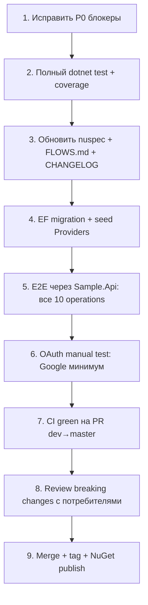

# План готовности релиза `dev` → `master`

> **Дата анализа:** 2026-06-29  
> **Ветка:** `dev`  
> **База сравнения:** `master...dev` (merge-base `163b8a5`)  
> **Цель:** исчерпывающий перечень нового функционала и чеклист проверки перед merge в `master`  
> **Легенда:** ⬜ open · ✅ done · 🟨 partial  
> **Источники:** `dotnet test`, `git diff master...dev`, `gh run list`

**Сводка чеклистов (2026-06-29):** **95** пунктов — ✅ **36** (38%) · 🟨 **8** (8%) · ⬜ **51** (54%)

---

## Сводка изменений

| Метрика | Значение |
|---------|----------|
| Коммитов | 105 |
| Файлов | 294 |
| Строк | +7 464 / −2 861 |
| Тестов (`dotnet test`) | 287 total · 286 passed · 1 failed |

| Область | Файлов | Роль в релизе |
|---------|--------|---------------|
| Cross.Identity | 138 | NuGet-библиотека: JWT, refresh, OAuth flows, licensing, cleanup |
| Cross.Identity.Tests | 62 | Unit + integration (NUnit) |
| Sample.Api | 4 | Минимальный API, smoke через Swagger |
| .github/workflows | 2 | CI/CD (`dotnet.yml`, `triage.yml`) |
| .cursor (rules + triage) | 21 | Конвенции, automated triage (не runtime) |
| docs | 2 | Triage-отчёты, этот план |
| Удалённые in-repo пакеты | ~65 | `Cross.Notification`, `Cross.PepperVault.*` → NuGet |

---

## Оглавление

1. [Полный перечень нового функционала](#1-полный-перечень-нового-функционала)
2. [Breaking changes](#2-breaking-changes-обязательно-для-потребителей-пакета)
3. [Чеклисты проверки по областям](#3-чеклист-по-функциональным-блокам)
4. [Автотесты — матрица покрытия](#4-автотесты--матрица-покрытия)
5. [Ручное/E2E через Sample.Api](#5-ручноеe2e-тестирование-через-sampleapi)
6. [CI/CD и инфраструктура](#6-cicd-и-инфраструктура)
7. [Документация и release notes](#7-документация-и-release-notes)
8. [Миграция БД](#8-миграция-бд-для-существующих-инсталляций)
9. [Blockers и риски](#9-блокеры-и-риски-перед-merge)
10. [Go / No-Go и порядок прогона](#10-рекомендуемый-порядок-работ-release-gate)

---

## 1. Полный перечень нового функционала

| # | Блок | Ключевые изменения | Коммиты/файлы |
|---|------|-------------------|---------------|
| A | **Регистрация (US-129)** | `license.Register` — email+password, без `ConfirmPassword`; `createUser` → `sendCode` → `LastCode`+`UserId` | `license.Register.json`, `UserService`, flow-тесты |
| B | **External OAuth** | Google/Microsoft/GitHub/Apple; шаги `initiateExternalLogin` / `completeExternalLogin`; flows `ExternalLogin`, `ExternalLoginCallback`; linking | `ExternalLoginService`, `ExternalOAuthProviders`, 2 JSON-flow |
| C | **Refresh Token / «Remember me»** | `AbsoluteExpiresAt`, цепочка `FamilyId`, ротация, фоновая очистка | `JwtTokenService`, `RefreshTokenStep`, `ExpiredRefreshTokenCleanupHostedService` |
| D | **Лицензирование JWT** | Проверка при первом `ExecuteAsync`; секция `CrossIdentity:LicenseKey` | `LicenseAccessor`, `LicenseValidator`, `FlowExecutor` |
| E | **Developer Mode** | Коды сохраняются в БД без отправки email/SMS | `CodeService`, `SendCodeStep`, `Authentication:DeveloperMode` |
| F | **Token / TokenByCode / RequestCode** | Сквозной сценарий request code → token by code | `License_RequestCode_TokenByCode_FlowTests` |
| G | **Reset Password** | Уведомление по email/SMS после смены; новые поля формы | `ResetPasswordStep`, `license.ResetPassword.json` |
| H | **Инфраструктура** | `UnitTests` → `Tests`, CI triage, PR-триггеры, обновление зависимостей | `.github/workflows/`, `.cursor/triage/` |

---

## 2. Breaking changes (обязательно для потребителей пакета)

### 2.1 API / контракты flow

| Изменение | Было (master) | Стало (dev) | Действие |
|-----------|---------------|-------------|----------|
| Операция `GetUser` | `FlowOperationEnum.GetUser` | **`GetUserId`** | Обновить клиенты: `license/GetUserId` |
| Flow-файл | `license.GetUser.json` | **`license.GetUserId.json`** | Обновить кастомные overrides |
| Удалённые flows | `license.Auth.json`, `license.register1.json` | удалены | Проверить, что никто их не вызывает |
| Ответ `collectResult` с 1 полем | голое значение (`"abc"`) | **всегда объект** `{ "field": "abc" }` | Обновить десериализацию на клиентах |
| `IFlowExecutor` / `FlowExecutor` | public class | **internal class** | Публичный контракт — только `IFlowExecutor` |

### 2.2 Модель данных

| Изменение | Действие |
|-----------|----------|
| Удалено поле `NormalizedEmail` | Миграция БД: колонка `NormalizedEmail` → использовать `Email`; при EF — новая миграция |
| `RefreshTokenEntity.AbsoluteExpiresAt` | Новая колонка; backfill для существующих токенов |
| `UserExternalLoginEntity` + FK на `ProviderEntity` | Проверить схему и seed провайдеров (Google, Microsoft, …) |

### 2.3 Зависимости NuGet

| Было | Стало |
|------|-------|
| `System.IdentityModel.Tokens.Jwt` | **`Microsoft.IdentityModel.JsonWebTokens` 8.16** |
| In-repo `Cross.Notification`, `Cross.PepperVault.*` | **`Cross.Messaging`**, **`Cross.PepperVault`** (NuGet) |
| `Magick.NET.Core` | **удалён** |
| `Cross.ErrorHandlers` 7.3 → **7.6**, `Cross.Headers` 1.0 → **1.2.1** | Обновить у потребителей при конфликтах |

> **Замечание:** `config.nuspec` всё ещё ссылается на `Magick.NET.Core` и старые версии `Cross.ErrorHandlers` — нужно синхронизировать перед публикацией.

---

## 3. Чеклист по функциональным блокам

### A. Регистрация (`license.Register`)

**Автотесты:** `License_Registration_FlowTests`, `LicenseRegisterFlowTests`, `CreateUser_StepTests`

| # | Проверка | Тип | Статус |
|---|----------|-----|--------|
| A1 | Регистрация с валидным email+password → `UserId` + `LastCode` в ответе | Integration | ✅ есть тест |
| A2 | Повторная регистрация с тем же email → ошибка | Integration | ⬜ проверить вручную |
| A3 | Валидация пароля (min 8, max 128) | Unit/Integration | ⬜ |
| A4 | `ConfirmPassword` больше не требуется — старые клиенты не ломаются | Manual | ⬜ |
| A5 | Код подтверждения сохраняется в `EmailVerifications` | Integration | ⬜ |
| A6 | `edoctors.Register` — по-прежнему с `ConfirmPassword` | Integration | ⬜ проверить `EDoctors_Registration_FlowTests` |
| A7 | `createUser` маппинг полей (`FullName`, `Company`, флаги) | Integration | ⬜ |

---

### B. External OAuth Login

**Автотесты:** `ExternalLoginServiceTests` (~717 строк), step/factory unit-тесты. **Нет integration flow-тестов** для `license.ExternalLogin` / `ExternalLoginCallback`.

#### B1. Конфигурация (обязательно перед любым ручным тестом)

```json
{
  "Authentication": {
    "ExternalLogin": {
      "CallbackUrl": "https://your-spa/callback",
      "StateLifetime": "00:10:00",
      "Providers": {
        "Google": {
          "ClientId": "...",
          "ClientSecret": "...",
          "IsEnabled": true
        }
      }
    }
  }
}
```

Env: `Authentication__ExternalLogin__CallbackUrl`, `Authentication__ExternalLogin__Providers__Google__ClientId`, и т.д.

| # | Проверка | Тип |
|---|----------|-----|
| B1 | `CallbackUrl` задан — иначе `InvalidOperationException` | Unit ✅ |
| B2 | Провайдер не в конфиге → `ValidationException` | Unit ✅ |
| B3 | Провайдер не в БД (`Providers` table) / disabled → `NotFoundException` | Unit ✅ |
| B4 | **Initiate:** `POST license/ExternalLogin` `{ Provider, ReturnUrl }` → `{ url }` с OAuth redirect | Manual/E2E ⬜ |
| B5 | **Callback:** `POST license/ExternalLoginCallback` `{ Code, State }` → `access_token`, `refresh_token`, `user_id` | Manual/E2E ⬜ |
| B6 | OAuth error (`Error`, `ErrorDescription`) → корректная ошибка | Unit ✅ |
| B7 | State TTL истёк → отказ | Manual ⬜ |
| B8 | **Новый пользователь** — auto-provision через `IExternalLoginUserProvisioner` (если зарегистрирован) | Manual ⬜ |
| B9 | **Существующий пользователь** — логин по provider+subject | Manual ⬜ |
| B10 | **Linking (авторизованный):** `LinkUserId` в state → `is_linking: true`, без новых токенов? | Unit + Manual ⬜ |
| B11 | **Linking без auth** → `NotAuthorizedException` | Unit ✅ |
| B12 | Повторный link того же провайдера → `ValidationException` | Unit ✅ |
| B13 | Google / Microsoft / GitHub / Apple — профиль (email, subject) | Manual per provider ⬜ |
| B14 | Multi-instance: state в `IMemoryCache` — **не работает за load balancer без sticky sessions** | Arch review ⬜ |

---

### C. Refresh Token / Remember Me

Реализовано через `AbsoluteExpiresAt` + `FamilyId` (см. `RefreshToken.md`), не через отдельный флаг `RememberMe`.

| # | Проверка | Тип | Статус |
|---|----------|-----|--------|
| C1 | Выдача пары access+refresh при `license.Token` (пароль) | Integration | ✅ |
| C2 | Выдача пары при `license.TokenByCode` | Integration | ✅ |
| C3 | Ротация: старый refresh инвалидируется, новый работает | Unit | ✅ `JwtTokenServiceTests` |
| C4 | `AbsoluteExpiresAt` сохраняется при ротации (цепочка) | Unit | ✅ |
| C5 | Refresh после `AbsoluteExpiresAt` → отказ | Unit/Manual | ⬜ |
| C6 | `RefreshTokenAbsoluteExpires` в конфиге влияет на новые цепочки | Manual | ⬜ |
| C7 | `ExpiredRefreshTokenCleanupHostedService` удаляет просроченные | Unit | ✅ |
| C8 | Интервал очистки `Authentication:TokenCleanupInterval` (default 1h) | Manual | ⬜ |
| C9 | `license.RefreshToken` flow end-to-end | Integration | ⬜ нет dedicated flow test |
| C10 | Reuse старого refresh после ротации → `NotAuthorizedException` | Manual | ⬜ |

**Конфиг для проверки:**

```json
"Authentication": {
  "Jwt": {
    "AccessTokenExpires": "00:15:00",
    "RefreshTokenExpires": "30.00:00:00",
    "RefreshTokenAbsoluteExpires": "60.00:00:00"
  },
  "TokenCleanupInterval": "01:00:00"
}
```

---

### D. Лицензирование JWT

| # | Проверка | Тип | Статус |
|---|----------|-----|--------|
| D1 | Ключ не задан → `LogCritical`, flow работает | Unit | ✅ |
| D2 | Невалидный JWT → `LogError`, flow работает | Unit | ✅ |
| D3 | Просроченный ключ → `LogError` + `LogCritical` | Unit | ✅ |
| D4 | Валидный ключ → `LogInformation` с edition/expiry | Unit | ✅ |
| D5 | Проверка только при **первом** вызове (singleton flag) | Unit | ✅ |
| D6 | `CrossIdentity:LicenseKey` из appsettings | Manual | ⬜ |
| D7 | `CrossIdentity__LicenseKey` из env | Manual | ⬜ |
| D8 | Неверный `ProductType` в ключе | Unit | ✅ |
| D9 | **Production policy:** нужно ли hard-fail без ключа? (сейчас soft-fail) | Product decision | ⬜ |

---

### E. Developer Mode

| # | Проверка | Тип | Статус |
|---|----------|-----|--------|
| E1 | `Authentication:DeveloperMode=true` → код в БД, email/SMS **не** отправляются | Unit | ✅ |
| E2 | `DeveloperMode=false` → отправка + сохранение | Unit | ✅ |
| E3 | `LastCode` возвращается в flow-ответе (для dev) | Integration | ✅ |
| E4 | Production: `DeveloperMode` **не задан** или `false` | Manual | ⬜ |
| E5 | `SendCodeStep` тоже учитывает DeveloperMode | Unit | ⬜ проверить |

---

### F. Token / TokenByCode / RequestCode

| # | Проверка | Тип | Статус |
|---|----------|-----|--------|
| F1 | `license.Token` — пароль ИЛИ код (валидация `atLeastOneRequired`) | Integration | ✅ |
| F2 | `license.TokenByCode` — только код | Integration | ✅ |
| F3 | RequestCode → TokenByCode сквозной сценарий | Integration | ✅ |
| F4 | Неверный код → `IsInvalidCode` / пустой токен | Manual | ⬜ |
| F5 | Истёкший код (TTL) | Manual | ⬜ |
| F6 | Превышение `MaxAttempts` (3) | Manual | ⬜ |
| F7 | `game.Token`, `shop.*` flows — регрессия | Integration | ⬜ нет тестов |

---

### G. Reset Password / Forgot Password

| # | Проверка | Тип | Статус |
|---|----------|-----|--------|
| G1 | `license.ForgotPassword` | Integration | ✅ |
| G2 | `ResetPasswordStep` — смена пароля + email-уведомление | Unit | ✅ |
| G3 | Уведомление при ошибке отправки — логируется, flow не падает | Unit | ✅ |
| G4 | **`license.ResetPassword.json` — потенциальный баг:** `passwordKey: "collectForm.Password"`, а в форме поля `NewPassword`, `OldPassword` | **Code review** | ⚠️ **блокер?** |
| G5 | Integration flow test для `license.ResetPassword` | — | ❌ отсутствует |
| G6 | Старый пароль / код + новый пароль — бизнес-логика | Manual | ⬜ |

> **Рекомендация:** перед релизом исправить `license.ResetPassword.json` (`passwordKey` → `collectForm.NewPassword`) и добавить flow-тест.

---

### H. Прочие изменения

| # | Проверка | Статус |
|---|----------|--------|
| H1 | `GetUserId` flow возвращает `{ user_id }` | ⬜ manual |
| H2 | `FlowExecutor` — `collectResult` всегда объект | ⬜ проверить все flows с 1 полем |
| H3 | `UserService` — provisioning, `ValidateCode`, `SetPassword` | Unit ✅ |
| H4 | Удаление `NormalizedEmail` — поиск по email case-insensitive | Unit ⬜ |
| H5 | `PasswordHasher` + Pepper через NuGet `Cross.PepperVault` | Manual в Sample.Api ⬜ |
| H6 | JWT encryption (`UseEncryption`, `EncryptionKey` Base64 32 bytes) | Unit ⬜ |
| H7 | Переход на `Microsoft.IdentityModel.JsonWebTokens` — валидация токенов downstream | Manual ⬜ |

---

## 4. Автотесты — матрица покрытия

```bash
# Полный прогон
dotnet test Cross.Identity.Tests/Cross.Identity.Tests.csproj

# По категориям
dotnet test --filter "Category=Unit"
dotnet test --filter "Category=Integration"

# С покрытием (opencover)
dotnet test Cross.Identity.Tests/Cross.Identity.Tests.csproj \
  --collect:"XPlat Code Coverage" \
  --results-directory ./TestResults \
  -- DataCollectionRunSettings.DataCollectors.DataCollector.Configuration.Format=opencover
```

| Область | Unit | Integration Flow | Пробел |
|---------|------|------------------|--------|
| Registration | ✅ | ✅ | — |
| Token / TokenByCode | ✅ | ✅ | — |
| RefreshToken | ✅ | ⬜ | нет flow test |
| External OAuth | ✅ (service) | ❌ | **добавить flow tests** |
| ResetPassword | ✅ (step) | ❌ | **добавить flow test** |
| Licensing | ✅ | ⬜ | — |
| ForgotPassword | ⬜ | ✅ | — |
| game/shop/edoctors flows | ⬜ | частично | регрессия |

**Текущий статус:** 287/287 passed.

---

## 5. Ручное/E2E тестирование через Sample.Api

```bash
dotnet run --project Sample.Api
# Swagger: POST /api/identity/{flow}/{operation}
```

| Сценарий | Endpoint | Body (пример) |
|----------|----------|---------------|
| Регистрация | `license/Register` | `{ "Email": "...", "Password": "..." }` |
| Запрос кода | `license/RequestCode` | `{ "Email": "...", "Ttl": "00:05:00" }` |
| Токен по коду | `license/TokenByCode` | `{ "Email": "...", "Code": "..." }` |
| Токен по паролю | `license/Token` | `{ "Email": "...", "Password": "..." }` |
| Refresh | `license/RefreshToken` | `{ "RefreshToken": "..." }` |
| GetUserId | `license/GetUserId` | `{ "Email": "..." }` |
| OAuth start | `license/ExternalLogin` | `{ "Provider": "Google" }` |
| OAuth callback | `license/ExternalLoginCallback` | `{ "Code": "...", "State": "..." }` |

**Перед E2E:**

1. Реальная БД (не только InMemory) — PostgreSQL/SQL Server
2. Seed таблицы `Providers` (Google, Microsoft, …)
3. Настроить OAuth credentials + `CallbackUrl`
4. `Authentication:DeveloperMode=false` + рабочий Cross.Messaging (email/SMS)
5. `CrossIdentity:LicenseKey` — валидный тестовый ключ

---

## 6. CI/CD и инфраструктура

| # | Проверка | Статус |
|---|----------|--------|
| CI1 | `dotnet.yml` — build + test на PR в `master`/`dev` | ⬜ прогнать на PR |
| CI2 | SonarCloud quality gate wait на PR | ⬜ |
| CI3 | `triage.yml` — automated PR triage | ⬜ smoke |
| CI4 | GitVersion: `dev` теперь **не** release branch | ⬜ проверить версионирование при merge |
| CI5 | NuGet pack из `config.nuspec` — зависимости актуальны | ⚠️ **нужно обновить** |

---

## 7. Документация и release notes

| # | Документ | Статус | Действие |
|---|----------|--------|----------|
| DOC1 | `README.md` | ✅ обновлён (licensing, структура) | — |
| DOC2 | `FLOWS.md` | ⚠️ устарел | Убрать `license.Auth`, `register1`, `GetUser`; добавить ExternalLogin, GetUserId |
| DOC3 | `RefreshToken.md` | ✅ актуален | — |
| DOC4 | `config.nuspec` releaseNotes | частично | Добавить breaking changes, External OAuth |
| DOC5 | `LICENSE.md` | обновлён (peshkov.biz) | — |
| DOC6 | Migration guide для потребителей | ❌ | Создать: GetUser→GetUserId, collectResult, JWT lib, NuGet deps |
| DOC7 | CHANGELOG / GitHub Release | ❌ | Перед релизом |

---

## 8. Миграция БД (для существующих инсталляций)

```sql
-- Примерные шаги (уточнить под вашу СУБД / EF migrations)

-- 1. Refresh tokens: новая колонка
ALTER TABLE RefreshTokens ADD AbsoluteExpiresAt datetime2 NOT NULL
  DEFAULT DATEADD(day, 30, CreatedAt);

-- 2. Users: убрать NormalizedEmail (если была)
-- UPDATE Users SET Email = NormalizedEmail WHERE Email IS NULL;
-- ALTER TABLE Users DROP COLUMN NormalizedEmail;

-- 3. Providers: seed OAuth-провайдеров
INSERT INTO Providers (Id, Name, IsEnabled) VALUES (...);

-- 4. UserExternalLogins: FK на Providers
```

| # | Проверка |
|---|----------|
| M1 | EF migration создана и протестирована на staging |
| M2 | Backfill `AbsoluteExpiresAt` для существующих refresh-токенов |
| M3 | Seed `Providers` для OAuth |
| M4 | Rollback-план |

---

## 9. Блокеры и риски перед merge

| Приоритет | Проблема | Рекомендация |
|-----------|----------|--------------|
| **P0** | `license.ResetPassword.json` — `passwordKey` не совпадает с полями формы | Исправить + тест |
| **P0** | Нет integration flow-тестов External OAuth | Добавить хотя бы mocked HTTP |
| **P1** | `config.nuspec` — устаревшие зависимости | Синхронизировать с `.csproj` |
| **P1** | `FLOWS.md` не соответствует коду | Обновить |
| **P1** | Breaking change `collectResult` (1 поле) | Release notes + migration guide |
| **P1** | OAuth state в `IMemoryCache` — не для multi-instance | Документировать / Redis |
| **P2** | Лицензия soft-fail в production | Продуктовое решение |
| **P2** | Нет EF migrations в репо | Добавить или документировать SQL |
| **P2** | `Sample.Api` — InMemory DB, нет OAuth config | Расширить пример |

---

## 10. Рекомендуемый порядок работ (release gate)



### Минимальный «go/no-go» чеклист

- [ ] Все 287+ тестов green
- [ ] P0 исправлены (`ResetPassword` JSON)
- [ ] 10 flow operations проверены через API
- [ ] OAuth initiate+callback работает (хотя бы Google)
- [ ] Refresh rotation + absolute expiry проверены вручную
- [ ] DeveloperMode выключен в prod-конфиге
- [ ] LicenseKey настроен (или осознанно soft-fail)
- [ ] Breaking changes задокументированы
- [ ] `config.nuspec` синхронизирован
- [ ] CI green на PR
